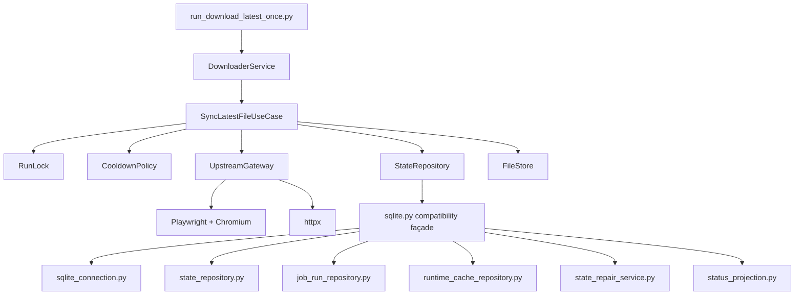

# Project Architecture Blueprint

## Scope

- Repository: `uspto_latest_downloader`
- Branch: `codex/cli-only-runtime`
- Goal: document the current post-refactor CLI-only architecture and identify the next optimization steps

## Current Conclusion

The branch is now a CLI-only local synchronization runtime. Compared with the earlier state, two major architecture changes are already in place:

1. synchronization orchestration has been extracted into a dedicated use-case class
2. SQLite persistence has been split into focused storage modules instead of one monolithic file

This means the branch has moved from a single large service plus a large storage file toward a clearer application/infrastructure split. The main remaining work is not another large rewrite. It is boundary polishing:

- reduce the compatibility façade in `storage/sqlite.py`
- rename CLI-neutral projection helpers that still carry `public` naming residue
- add operator-facing CLI commands for status and audit visibility
- keep the minimal regression suite in place as more cleanup lands

## Runtime Model

### Entry Point

- [run_download_latest_once.py](/Users/lin/Documents/Code/3月份/uspto_latest_downloader/uspto_latest_downloader/run_download_latest_once.py)

### Core Layers

- Shared config, errors, contracts, and logging:
  - [core/common.py](/Users/lin/Documents/Code/3月份/uspto_latest_downloader/uspto_latest_downloader/core/common.py)
  - [core/contract.py](/Users/lin/Documents/Code/3月份/uspto_latest_downloader/uspto_latest_downloader/core/contract.py)
  - [core/logging_utils.py](/Users/lin/Documents/Code/3月份/uspto_latest_downloader/uspto_latest_downloader/core/logging_utils.py)
  - [core/runtime_security.py](/Users/lin/Documents/Code/3月份/uspto_latest_downloader/uspto_latest_downloader/core/runtime_security.py)

- Application orchestration:
  - [sync/service.py](/Users/lin/Documents/Code/3月份/uspto_latest_downloader/uspto_latest_downloader/sync/service.py)
  - [sync/use_case.py](/Users/lin/Documents/Code/3月份/uspto_latest_downloader/uspto_latest_downloader/sync/use_case.py)
  - [sync/collaborators.py](/Users/lin/Documents/Code/3月份/uspto_latest_downloader/uspto_latest_downloader/sync/collaborators.py)

- Infrastructure and domain-adjacent logic:
  - [sync/upstream.py](/Users/lin/Documents/Code/3月份/uspto_latest_downloader/uspto_latest_downloader/sync/upstream.py)
  - [sync/zip_utils.py](/Users/lin/Documents/Code/3月份/uspto_latest_downloader/uspto_latest_downloader/sync/zip_utils.py)

- Storage split:
  - [storage/sqlite.py](/Users/lin/Documents/Code/3月份/uspto_latest_downloader/uspto_latest_downloader/storage/sqlite.py)
  - [storage/sqlite_connection.py](/Users/lin/Documents/Code/3月份/uspto_latest_downloader/uspto_latest_downloader/storage/sqlite_connection.py)
  - [storage/state_repository.py](/Users/lin/Documents/Code/3月份/uspto_latest_downloader/uspto_latest_downloader/storage/state_repository.py)
  - [storage/job_run_repository.py](/Users/lin/Documents/Code/3月份/uspto_latest_downloader/uspto_latest_downloader/storage/job_run_repository.py)
  - [storage/runtime_cache_repository.py](/Users/lin/Documents/Code/3月份/uspto_latest_downloader/uspto_latest_downloader/storage/runtime_cache_repository.py)
  - [storage/state_repair_service.py](/Users/lin/Documents/Code/3月份/uspto_latest_downloader/uspto_latest_downloader/storage/state_repair_service.py)
  - [storage/status_projection.py](/Users/lin/Documents/Code/3月份/uspto_latest_downloader/uspto_latest_downloader/storage/status_projection.py)

- Minimal regression suite:
  - [tests/test_cli_minimal.py](/Users/lin/Documents/Code/3月份/uspto_latest_downloader/uspto_latest_downloader/tests/test_cli_minimal.py)
  - [tests/test_runtime_minimal.py](/Users/lin/Documents/Code/3月份/uspto_latest_downloader/uspto_latest_downloader/tests/test_runtime_minimal.py)

## Current Execution Flow

1. `run_download_latest_once.py` configures logging and builds `DownloaderService`.
2. `DownloaderService` assembles collaborators and delegates runtime work to `SyncLatestFileUseCase`.
3. `SyncLatestFileUseCase` acquires a run lock, creates a `job_runs` record, checks cooldown, marks runtime state as running, executes upstream attempts with retry, updates state/history, finalizes audit state, and releases the lock.
4. `UpstreamGateway` obtains or refreshes cookies, fetches USPTO metadata, selects the latest remote ZIP, and delegates download/skip behavior to `FileStore`.
5. `StateRepository` uses the split storage modules to read/write SQLite state, audit data, runtime cache, and repair projections.

## Current Architecture Diagram

## What Improved In This Branch

### 1. Orchestration is no longer centered in one large service class

Before this refactor, `DownloaderService` contained most of the sync lifecycle itself. Now:

- [sync/service.py](/Users/lin/Documents/Code/3月份/uspto_latest_downloader/uspto_latest_downloader/sync/service.py) is primarily an assembly layer
- [sync/use_case.py](/Users/lin/Documents/Code/3月份/uspto_latest_downloader/uspto_latest_downloader/sync/use_case.py) contains the sync use case
- [sync/collaborators.py](/Users/lin/Documents/Code/3月份/uspto_latest_downloader/uspto_latest_downloader/sync/collaborators.py) provides narrower substitution points

### 2. Storage responsibilities are now explicitly separated

The earlier `storage/sqlite.py` monolith has been decomposed into:

- connection and schema initialization
- state persistence
- job-run persistence
- runtime cache persistence
- state repair
- status projection

This is a real architecture improvement even though [storage/sqlite.py](/Users/lin/Documents/Code/3月份/uspto_latest_downloader/uspto_latest_downloader/storage/sqlite.py) still exists as a compatibility façade.

### 3. Security defaults are safer

- Cookie persistence is now disabled by default through `DEFAULT_COOKIE_CACHE_TTL_SECONDS = 0`
- runtime artifacts are permission-hardened
- unexpected CLI failures no longer echo raw internal exception text to stdout

### 4. Minimal automated regression validation is back

The branch now has a minimal non-network regression suite covering:

- CLI success envelope
- CLI internal failure sanitization
- cooldown blocking
- cross-process lock conflict
- legacy SQLite state migration
- runtime permission hardening

## Remaining Architecture Issues

### 1. `storage/sqlite.py` is still a wide compatibility façade

The file is much smaller in responsibility than before, but it still forwards a large number of methods to the split storage modules. That is acceptable as an intermediate state, but it keeps one synthetic “god façade” in the design.

Next step:

- gradually let `StateRepository` compose narrower storage collaborators directly
- then shrink or remove the façade

### 2. Some CLI-neutral logic still carries legacy naming

There are still methods like `_select_public_state_records(...)` in the status projection/repair path. They no longer serve a public HTTP surface, so their naming should be normalized around runtime status projection instead of “public” semantics.

Next step:

- rename these helpers to CLI-neutral names such as `select_status_records(...)`

### 3. Operator commands are still too limited

The runtime now has a cleaner internal architecture, but the external operator interface is still only:

- `python run_download_latest_once.py`

Yet the runtime already supports:

- current status projection
- job-run history listing
- state repair

Next step:

- add `status`, `job-runs`, and `repair-history` CLI subcommands

### 4. Domain state is still dictionary-heavy

`RemoteRecord` is typed, but most other data exchanged between the use case, repository, and CLI remains `dict[str, Any]`.

Next step:

- introduce typed dataclasses for `ServiceState`, `SyncResult`, `FailureCooldown`, and `JobRunView`

## Current Security Posture

### Positive controls already present

- path traversal protection for upstream filenames
- upstream download URL allowlist
- ZIP signature and structure validation
- cross-process file lock
- retry with jitter
- failure cooldown
- default non-persistent cookie behavior
- runtime permission hardening for `runtime/`, `app.db`, WAL/SHM, and `.download.lock`

### Security assumptions

- the runtime is deployed on a single trusted host
- if cookie persistence is explicitly enabled via `USPTO_COOKIE_CACHE_TTL_SECONDS > 0`, the `runtime/` directory must remain owner-only
- there is no external auth boundary because the branch is CLI-only

## Recommended Next Optimization Steps

### Priority 1

- Add operator-facing CLI commands for `status`, `job-runs`, and `repair-history`
- Rename legacy `public`-named projection helpers to runtime-neutral names
- Keep the minimal regression suite green on every refactor

### Priority 2

- Replace the `DownloaderStorageMixin` façade with direct repository composition
- Introduce typed runtime models instead of raw dictionaries across the use case boundary

### Priority 3

- Add a lightweight release preflight command that checks:
  - Playwright import
  - Chromium availability
  - runtime permission hardening
  - SQLite read/write

## Deployment Readiness Notes

Before release, the branch should continue to satisfy all of the following:

- `make test`
- `make pycompile`
- at least one real CLI smoke run against the current environment
- Playwright import available
- Chromium installed
- dependency vulnerability scan completed

## Bottom Line

This branch is no longer in the “single large service + single large SQLite module” state. The architecture has crossed the important threshold: orchestration and persistence responsibilities are now explicitly split. The remaining work is refinement, not another foundational rewrite.
