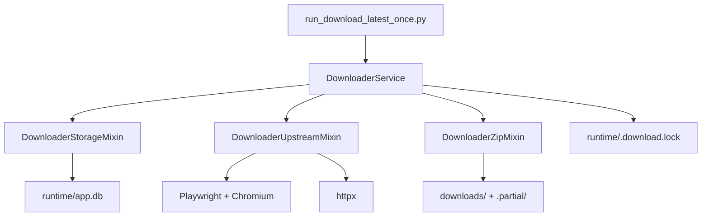
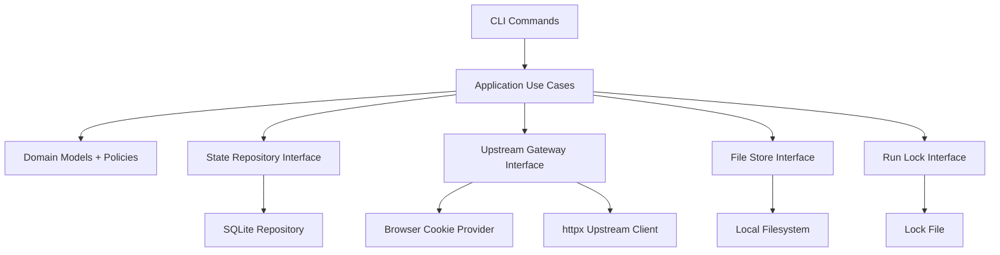

# Project Architecture Blueprint

## Scope

- Repository: `uspto_latest_downloader`
- Branch analyzed: `codex/cli-only-runtime`
- Analysis mode: local static architecture review
- Objective: produce an optimization-oriented blueprint for the current CLI-only runtime

## Executive Summary

The current branch is a compact CLI-first synchronization tool that downloads the latest USPTO ZIP dataset to local disk and persists runtime state in SQLite. The codebase is operationally simple and deployable on a single host, but the internal architecture is still carrying the shape of a previously larger service:

- orchestration is concentrated in one large `DownloaderService`
- persistence and state reconciliation logic dominate the codebase
- several storage methods remain from the removed HTTP surface and no longer have external callers
- domain data is passed mostly as raw dictionaries, which makes refactoring and validation harder
- the branch no longer contains automated tests, so future architectural refactors are now higher risk

The right optimization direction is not “add more framework”. It is to make the current local-runtime design more explicit:

1. separate application orchestration from infrastructure
2. replace mixin-heavy composition with narrower collaborators
3. isolate dead HTTP-era compatibility code
4. strengthen typed domain boundaries
5. add minimal operator commands for status and audit access without reintroducing a web layer

## Current Runtime Shape

### Entry Points

- CLI entry: [run_download_latest_once.py](/Users/lin/Documents/Code/3月份/uspto_latest_downloader/uspto_latest_downloader/run_download_latest_once.py)
- Build helper: [Makefile](/Users/lin/Documents/Code/3月份/uspto_latest_downloader/uspto_latest_downloader/Makefile)

### Core Modules

- Shared runtime constants and errors: [core/common.py](/Users/lin/Documents/Code/3月份/uspto_latest_downloader/uspto_latest_downloader/core/common.py)
- Payload contract helpers: [core/contract.py](/Users/lin/Documents/Code/3月份/uspto_latest_downloader/uspto_latest_downloader/core/contract.py)
- Structured logging: [core/logging_utils.py](/Users/lin/Documents/Code/3月份/uspto_latest_downloader/uspto_latest_downloader/core/logging_utils.py)
- Main orchestration: [sync/service.py](/Users/lin/Documents/Code/3月份/uspto_latest_downloader/uspto_latest_downloader/sync/service.py)
- Upstream session and metadata access: [sync/upstream.py](/Users/lin/Documents/Code/3月份/uspto_latest_downloader/uspto_latest_downloader/sync/upstream.py)
- ZIP validation and local file operations: [sync/zip_utils.py](/Users/lin/Documents/Code/3月份/uspto_latest_downloader/uspto_latest_downloader/sync/zip_utils.py)
- SQLite state and audit persistence: [storage/sqlite.py](/Users/lin/Documents/Code/3月份/uspto_latest_downloader/uspto_latest_downloader/storage/sqlite.py)

### Size Snapshot

- [run_download_latest_once.py](/Users/lin/Documents/Code/3月份/uspto_latest_downloader/uspto_latest_downloader/run_download_latest_once.py): 157 lines
- [sync/service.py](/Users/lin/Documents/Code/3月份/uspto_latest_downloader/uspto_latest_downloader/sync/service.py): 546 lines
- [sync/upstream.py](/Users/lin/Documents/Code/3月份/uspto_latest_downloader/uspto_latest_downloader/sync/upstream.py): 354 lines
- [sync/zip_utils.py](/Users/lin/Documents/Code/3月份/uspto_latest_downloader/uspto_latest_downloader/sync/zip_utils.py): 282 lines
- [storage/sqlite.py](/Users/lin/Documents/Code/3月份/uspto_latest_downloader/uspto_latest_downloader/storage/sqlite.py): 1137 lines
- Runtime code total across the main modules above: about 2816 lines

## Current Execution Flow

### Main Sync Path

1. `run_download_latest_once.py` configures logging and builds a service instance.
2. `DownloaderService.run_download_latest()` acquires a file lock.
3. A job run row is created in SQLite.
4. The service checks whether a failure cooldown is active.
5. Runtime state is marked as `running`.
6. The service obtains cookies from runtime cache or Playwright.
7. It uses `httpx` to fetch USPTO metadata.
8. It selects the latest valid remote ZIP record.
9. It skips download if a valid local ZIP already exists.
10. Otherwise it downloads into `.partial`, validates the archive, and atomically moves it into place.
11. State, history, and job-run audit data are updated.
12. Cooldown is cleared or applied.
13. The lock is released and a JSON payload is printed to stdout.

### Current Architecture Diagram



## Architectural Strengths

- Single responsibility at the deployment level: one CLI process, one synchronization job.
- Operationally cheap: no external database, queue, cache, or web service runtime.
- Good defensive behavior around download integrity:
  - filename validation
  - upstream URL allowlist
  - HTML/WAF response rejection
  - byte-size verification
  - ZIP structure verification
- Good local resilience patterns:
  - cross-process lock
  - retry with exponential backoff and jitter
  - cooldown after repeated retryable failure
  - runtime cache for browser cookies
- Useful audit model already exists:
  - `service_state`
  - `download_history`
  - `job_runs`
  - `runtime_cache`

## Architecture Issues That Matter For Optimization

### 1. Orchestration is too concentrated

[sync/service.py](/Users/lin/Documents/Code/3月份/uspto_latest_downloader/uspto_latest_downloader/sync/service.py) currently owns:

- environment-derived configuration assembly
- lock lifecycle
- retry lifecycle
- cooldown lifecycle
- status snapshot fallback behavior
- state mutation rules
- job-run start and finalize orchestration

This makes `DownloaderService` the main change magnet. Even though the file uses mixins, the public behavior still converges into one class and one main method: [run_download_latest()](/Users/lin/Documents/Code/3月份/uspto_latest_downloader/uspto_latest_downloader/sync/service.py#L312).

Optimization implication:

- changes to retries, state, or CLI output still require editing the same orchestration area
- there is no clean application service boundary separate from infrastructure mechanics

### 2. Persistence layer is oversized and mixed-purpose

[storage/sqlite.py](/Users/lin/Documents/Code/3月份/uspto_latest_downloader/uspto_latest_downloader/storage/sqlite.py) is the largest file in the repository. It currently mixes:

- SQLite access and schema creation
- legacy migration from `state.json`
- runtime cache handling
- audit summary building
- state normalization
- disk reconciliation
- download-history selection logic
- status projection logic

This file is doing repository work, projection work, and repair work at the same time.

Optimization implication:

- the storage layer is not just “persistence”
- architectural boundaries are blurred, which makes it hard to reason about what belongs in SQLite code versus application logic

### 3. HTTP-era storage cleanup is only partially complete

The explicit HTTP-era projection methods have been removed from [storage/sqlite.py](/Users/lin/Documents/Code/3月份/uspto_latest_downloader/uspto_latest_downloader/storage/sqlite.py), which is the right direction for this branch.

What still remains is a naming and responsibility residue:

- `_select_public_state_records(...)`
- `_normalize_state_record(...)`
- `_record_uses_local_file(...)`

These are still used by the CLI status-building path, but their naming and projection role were inherited from the removed web surface.

Optimization implication:

- dead code has been reduced, but the persistence layer still carries presentation-oriented terminology
- a second cleanup pass should rename or relocate these helpers into a CLI-neutral status projection boundary

### 4. Domain state is mostly untyped dictionaries

The code has one strong domain type, [RemoteRecord](/Users/lin/Documents/Code/3月份/uspto_latest_downloader/uspto_latest_downloader/core/common.py#L84), but most other runtime state uses raw `dict[str, Any]`.

Examples:

- service state
- job-run payloads
- runtime cache payloads
- CLI status payload
- serialized error payloads

Optimization implication:

- state shape changes are harder to audit
- serialization concerns leak into business logic
- refactors rely more on manual inspection than on type guidance

### 5. Mixins are being used as architectural layers

`DownloaderService` inherits from:

- `DownloaderStorageMixin`
- `DownloaderZipMixin`
- `DownloaderUpstreamMixin`

This works for code sharing, but it also hides architectural seams:

- a repository is not an interchangeable service collaborator
- ZIP filesystem behavior is not just a shared helper
- upstream browser bootstrap is a distinct infrastructure concern

Optimization implication:

- inheritance is masking component boundaries that should be explicit composition
- testing seams and substitution points are weaker than they need to be

### 6. Operator interface is too narrow for a CLI-only branch

The runtime is CLI-only, but the branch now has only one operator command:

- `run_download_latest_once.py`

The persistence layer already supports useful operations such as:

- [build_status()](/Users/lin/Documents/Code/3月份/uspto_latest_downloader/uspto_latest_downloader/storage/sqlite.py#L820)
- [list_job_runs()](/Users/lin/Documents/Code/3月份/uspto_latest_downloader/uspto_latest_downloader/storage/sqlite.py#L634)
- [repair_download_history_from_disk()](/Users/lin/Documents/Code/3月份/uspto_latest_downloader/uspto_latest_downloader/storage/sqlite.py#L1093)

But none of them are surfaced as explicit CLI commands.

Optimization implication:

- operational visibility now requires direct code usage or SQLite inspection
- the removed web endpoints were not replaced by an operator-friendly CLI surface

### 7. The branch no longer has automated tests

The current branch intentionally removed the local test suite.

Optimization implication:

- architectural refactor risk is now materially higher
- cleanup work must be phased and small unless tests are reintroduced later

This does not mean “tests must come back first”, but it does mean architecture work should prefer boundary extraction over behavior rewriting.

## Optimization Objectives

The architecture should be optimized for these outcomes:

1. keep the runtime local-first and CLI-first
2. reduce the size and responsibility breadth of the orchestration layer
3. make domain state shapes explicit
4. separate persistence, upstream access, filesystem, and orchestration
5. expose operational introspection through CLI commands
6. remove dead HTTP-era compatibility code from the runtime branch

## Recommended Target Architecture

### Target Package Layout

```text
uspto_latest_downloader/
├── cli/
│   ├── main.py
│   ├── sync_latest.py
│   ├── show_status.py
│   ├── list_job_runs.py
│   └── repair_history.py
├── application/
│   ├── sync_latest_use_case.py
│   ├── status_service.py
│   └── audit_service.py
├── domain/
│   ├── models.py
│   ├── errors.py
│   ├── policies.py
│   └── state.py
├── infrastructure/
│   ├── sqlite_state_repository.py
│   ├── file_store.py
│   ├── upstream_client.py
│   ├── browser_cookie_provider.py
│   └── run_lock.py
├── core/
│   ├── config.py
│   ├── logging_utils.py
│   └── contract.py
└── run_download_latest_once.py
```

This does not require a framework migration. It is a packaging and boundary improvement.

### Target Dependency Rule

- `cli/` can depend on `application/`, `domain/`, `core/`
- `application/` can depend on `domain/`, `core/`, and infrastructure interfaces
- `infrastructure/` can depend on `domain/` and `core/`
- `domain/` should depend only on Python stdlib and minimal shared contracts

### Target Architecture Diagram



## Concrete Refactoring Recommendations

### Recommendation A: Split `DownloaderService` into a use case plus collaborators

Current problem:

- orchestration logic and infrastructure usage are tightly interwoven

Refactor target:

- `SyncLatestFileUseCase`
- `RunLock`
- `CooldownPolicy`
- `UpstreamGateway`
- `StateRepository`
- `FileStore`

Expected gain:

- a smaller application core
- clearer substitution points
- less inheritance-driven coupling

### Recommendation B: Decompose `storage/sqlite.py`

Current problem:

- one file is acting as repository, migration manager, runtime cache, projection builder, and reconciliation helper

Refactor target:

- `sqlite_connection.py`
- `state_repository.py`
- `job_run_repository.py`
- `runtime_cache_repository.py`
- `state_repair_service.py`
- `status_projection.py`

Expected gain:

- lower cognitive load
- better separation between persistence and projection logic
- easier incremental cleanup of dead methods

### Recommendation C: Remove dead HTTP-era methods in a dedicated cleanup pass

Current problem:

- branch still contains unused “public status” and file download projection methods

Refactor target:

- remove unused public-status projection methods after replacing any hidden internal dependency
- if download-resolution logic is still useful, keep only the filesystem-oriented part under a better name such as `resolve_latest_local_file()`

Expected gain:

- less misleading architecture
- smaller persistence surface

### Recommendation D: Introduce typed state objects

Current problem:

- most runtime state is shaped through raw dictionaries

Refactor target:

- add dataclasses or typed records for:
  - `ServiceState`
  - `JobRun`
  - `RuntimeCacheItem`
  - `FailureCooldown`
  - `SyncResult`

Expected gain:

- clearer contracts
- easier serialization boundaries
- safer refactoring of payload shape

Preferred approach:

- use stdlib `dataclass` plus explicit `to_dict()` / `from_dict()` first
- avoid reintroducing a heavy schema framework unless a real need appears

### Recommendation E: Expand the CLI surface instead of reintroducing HTTP

Current problem:

- operator introspection exists in code but not in the command interface

Refactor target:

- `python run_download_latest_once.py sync-latest`
- `python run_download_latest_once.py status`
- `python run_download_latest_once.py job-runs --limit 20`
- `python run_download_latest_once.py repair-history`

Expected gain:

- preserves the branch’s CLI-only deployment model
- restores observability without a web runtime
- makes the audit data actually usable

Preferred implementation:

- stay with `argparse` to keep dependencies minimal

### Recommendation F: Separate policy from mechanics

Current problem:

- retry, jitter, cooldown, and state transitions are mixed directly into orchestration code

Refactor target:

- `RetryPolicy`
- `CooldownPolicy`
- `SyncStateTransitionRules`

Expected gain:

- easier tuning
- clearer reasoning about failure behavior
- fewer side effects buried inside one method

## Suggested Refactoring Sequence

### Phase 1: Safe structural cleanup

- add `Project_Architecture_Blueprint.md`
- move configuration loading from `build_latest_service()` into `core/config.py`
- extract repository and gateway interfaces without changing runtime behavior
- remove dead HTTP-only methods that have no callers

Risk:

- low to medium

### Phase 2: Orchestration decomposition

- replace mixin-driven service inheritance with explicit collaborators
- move retry and cooldown behavior into policy classes
- move file lock handling into its own helper

Risk:

- medium

### Phase 3: CLI capability expansion

- add `status`, `job-runs`, and `repair-history` commands
- keep `sync-latest` as the default command for backward compatibility

Risk:

- low

### Phase 4: Data contract hardening

- introduce typed runtime models
- restrict dictionary use to repository serialization boundaries

Risk:

- medium

## Priority Matrix

| Priority | Item | Why |
| --- | --- | --- |
| P1 | Remove dead HTTP-era storage methods | Low-cost cleanup with immediate architectural clarity |
| P1 | Extract config loading into a dedicated module | Simplifies service construction and future CLI growth |
| P1 | Add CLI status and audit commands | Restores operator visibility in a CLI-only branch |
| P2 | Break up `storage/sqlite.py` | Largest maintainability win after dead-code cleanup |
| P2 | Replace mixin-centric service with explicit collaborators | Strong long-term architecture improvement |
| P3 | Introduce typed state models | High value, but best done after module boundaries improve |

## What Should Stay As-Is

- SQLite as the local runtime store
- Playwright as the cookie bootstrap mechanism
- `httpx` for upstream metadata and file transport
- file-based run lock
- structured JSON logs to `stderr`
- local filesystem storage under `downloads/` and `runtime/`

These are aligned with the branch’s operational profile and do not need replacement to achieve a cleaner architecture.

## Non-Goals

- reintroducing a web API
- adding a full ORM
- adding a distributed queue or cache
- converting the runtime to async end-to-end
- expanding deployment complexity with containers or orchestration just for architecture purity

## Immediate Next Actions

1. Rename or relocate the remaining public-named status projection helpers inside [storage/sqlite.py](/Users/lin/Documents/Code/3月份/uspto_latest_downloader/uspto_latest_downloader/storage/sqlite.py).
2. Extract runtime configuration loading from [sync/service.py](/Users/lin/Documents/Code/3月份/uspto_latest_downloader/uspto_latest_downloader/sync/service.py#L483) into a dedicated config module.
3. Introduce a `status` CLI command backed by [build_status()](/Users/lin/Documents/Code/3月份/uspto_latest_downloader/uspto_latest_downloader/storage/sqlite.py#L820).
4. Split [storage/sqlite.py](/Users/lin/Documents/Code/3月份/uspto_latest_downloader/uspto_latest_downloader/storage/sqlite.py) before any larger behavior rewrite.
5. Only after the boundaries are cleaner, replace mixin inheritance with explicit collaborator injection.

## Bottom Line

The branch is already operationally lean. The real optimization opportunity is not to simplify deployment further, but to simplify internal boundaries. The code should evolve from “one orchestrator class plus large utility mixins” into a small application core sitting on explicit storage, upstream, filesystem, and policy collaborators. That will reduce maintenance cost without changing the branch’s intentionally simple CLI-only runtime model.
